 
# Men of Wales

The Men of Wales website is the central function of the Men of Wales grassroots charity. This charity aims to improve the mental health and wellbeing of men across South Wales by facilitating group walks for new and current service users. The website features current group walks for visitors to view and book, and also offers direction to other services that can help with mental health.

### Wedsite multi device display here
---

## Images of page features here

### Home Page

#### Navbar 

I chose to use Bootstrap framework as a base for the collapsing Navbar, to allow for a responsive and clean design across all screen sizes.
* Contains navigation links to all pages for quick and easy access for the visitor
* Replicated across all pages

#### Footer

The footer design is simple and concise, allowing users to navigate to the charity’s social media, copyright information, and a home link to return to the main page. The footer is pushed to the bottom using the website’s flex column design, with a flex 1 property on the {main} element to ensure it takes growth priority.

#### Walking image carousel 

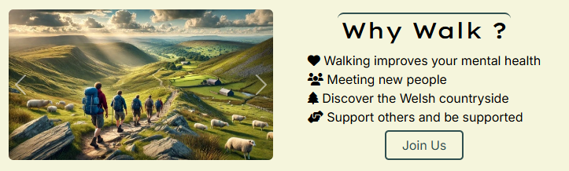

Image carousel section for quick display of walks long with facts and navigation. Used Bootsrap for base carousel framework, then customised to suit.

* Images of past group walks for visitors scrolling the home page
* Facts for why walking is great
* Join us button for quick navigation to walks page

#### Need Help Support card

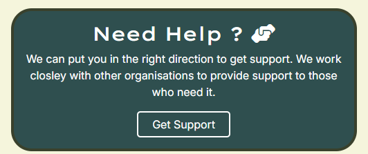

Support card on the homepage is for visitor navigation to the need help page.

* This card is coloured differently to allow for easy visual identification in case a visitor is in crisis.
* Features get support button, navigates to support page

#### Walkers words text carousel

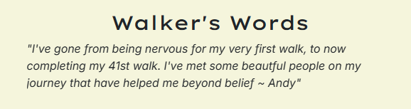

Autoplay text carousel for walkers reviews. Used Bootstrap autoplay (no controls) carousel for base. Then customised to be text only.

* Features walkers words for visitors to hear from other users.

#### About us shortcut card

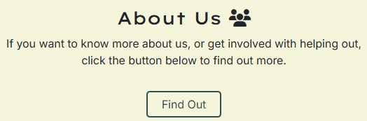

About us allowsthe visitor an option to learn about the organisation whilst at near the bottom of the page.

### Walk Page

#### Walk Cards
 
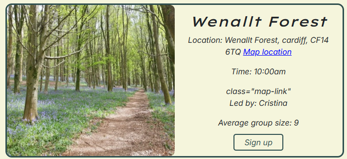

The Walk card is designed with Bootstrap's row class design. Cards are designed to give visitor an insight as to what to expect fromt the walk.

* Image of Walk
* Location of walk, along with map loacation
* Time of meet-up
* Walk leader
* Average group size

The big stuff card is for big organised walks.

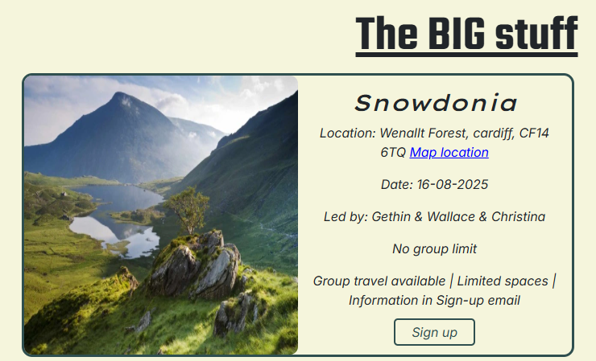

### About Us page

The about us page is a mainly text bassed page for allowing the visitor to understand who we are and what we want to work towards, along with som stats. 

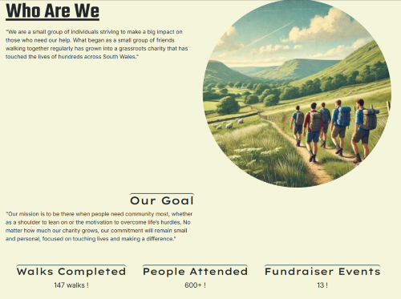

### Need help page

This page is designed for visitors seeking extra support. It features cards highlighting organisations for crisis helplines and general support. We’ve included diverse options to cater to various needs.

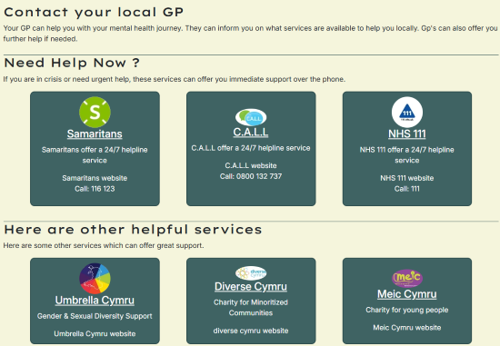

Along with the cards, we have general guidance for connecting with local GP.

### Sign Up page

The Sign-Up page is a form where visitors can register to join one of the Men of Wales walks.

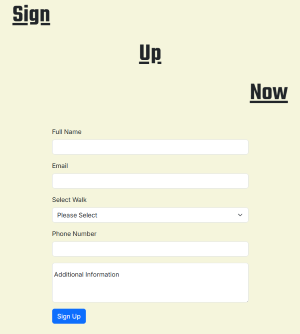

This form utilises the required function to ensure it is filled out correctly by the visitor, with minimal allowance for error.

When the visitor submits the form, they are taken to a success page, where they are informed that the form submission was successful.

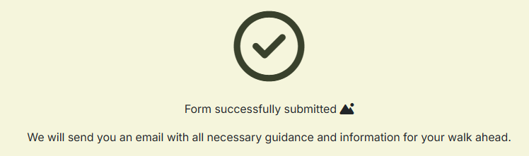

### 404 error page

Custom page has been added for continuity of design.

---

### link to Wireframes Here !

PDF file containing all Wireframes designs
[Wireframes PDF](/Milestone_P1/MenOfWales_Wireframes.pdf)

---

### Technologies Used Here
----

* HTML
  * main strucure on of the website

* CSS
  * Styling the website with css external file

* JavaScript
  * Used for adding in bootStrap & Fontawesome funtionality

* Bootstrap
  * Used for framework of various sections (tagged with Bootstrap)

* Favicon.io
  * Used for favicons generated 

* Fontawesome
  * Used for Icons across site

* ChatGPT
  * Used for generation website logo and images used

* Balsamic
  * Creating and designing the Wireframes for Men of Wales 

* Git hub
  * used for hosting files and deployment

* Git
  * Used for commiting changes and pushing to Github.

* VS Code
  * Code editor used for writing all code in this project. 

* Lighthouse 
  * USed for website performance testing

* Wave 
  * Used for testing website  accessability

* W3cs
  * Used for code validation

---

## Testing

#### Use wave.webaim for accessability testing

### W3C Code Validation

I used W3C code validator for checking all HTML code is valid. I pasted each pages code into the validatior individually for most accurate validation.

#### index.html

#### walks.html
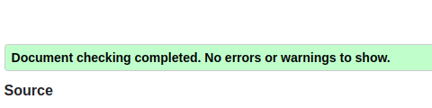

#### aboutUs.html
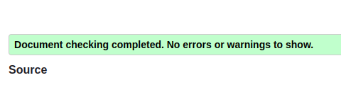

#### needhelp.html
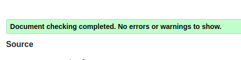

#### signUp.html
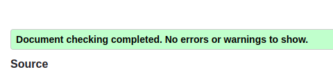

#### success.html
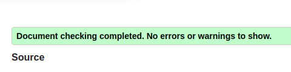

#### style.css
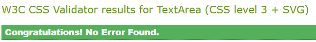

Satisfied with the result of no errors accross all pages individually, I then tested the HTMl and CSS with URL testing method.

#### URL test HTML
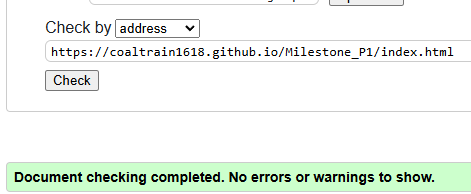

#### URL test CSS
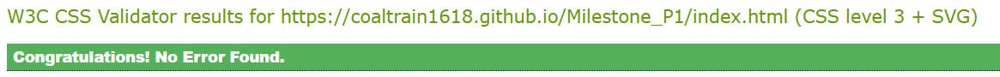

Both tests yielded no errors.

## Light house testing for performance scores

I used Lighthouse testing for performance tests, checking that the site runs smoothly on both desktop and mobile. As expected, mobile results are slightly lower.

When putting each page through testing, tests showed that the images were originally oversized, causing unnecessary load times. As a result, I resized every image on the website for better optimisation, as well as changed their format to .webp.

### Results

#### Index Desktop & Mobile
* Desktop
  * 
* Mobile  
  * 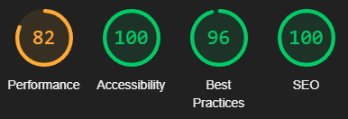

#### Walks Desktop & Mobile
* Desktop
  * 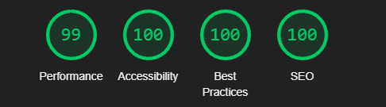
* Mobile  
  * 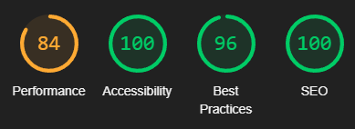

#### About Us Desktop & Mobile
* Desktop  
  * 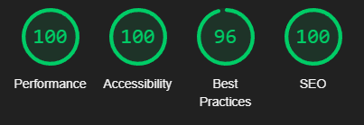
* Mobile  
  * 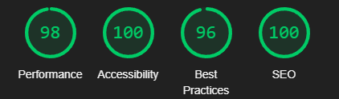

#### Need Support Desktop & Mobile
* Desktop  
  * 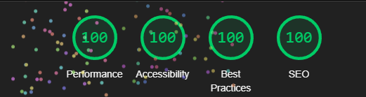
* Mobile
  * 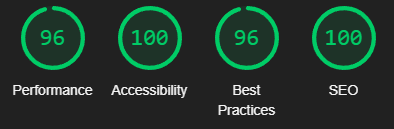

#### Sign Up Desktop & Mobile
* Desktop  
  * 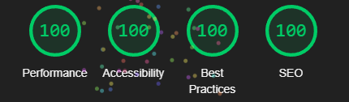
* Mobile
  * 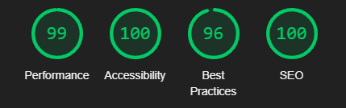

#### Success Desktop & Mobile
* Desktop  
  * 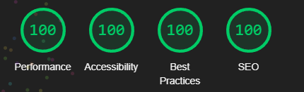
* Mobile
  * 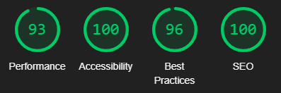
---

### Deployment

IDE used VS code

insert info about GIT commands

insert info on Git Hub

---

### Credits Here

