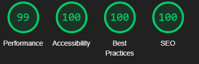

 
# Men of Wales

The Men of Wales website is the central function of the Men of Wales grassroots charity. This charity aims to improve the mental health and wellbeing of men across South Wales by facilitating group walks for new and current service users. The website features current group walks for visitors to view and book, and also offers direction to other services that can help with mental health.

---

### Home Page

#### Navbar 

* Contains navigation links to different pages on the site, allowing the visitor to navigate efficiently
* enhances the user experience, ensuring quick navigation and improving engagment.

#### Footer

* Provide users with quick access to social media platforms and display copyright information clearly.
* Enhances user engagement by encouraging social media interaction aswell as display important copyright information.

#### Walking image carousel 

* Display past walks through using an image carousel, along with the title "Why Walk?" with informative facts and a link to the walks page for further browsing.
* Captures user interest by displaying past walks, educates visitors on the benefits of walking, and encourages further interst to the walks page.

#### Need Help Support card

* Provide users with an accessible and clear option to seek additional support services. featuring supportive and comforting text.
* Allows users to quickly identify further support page incase they need fast access to helplines. 

#### Walkers words text carousel

* Showcases an auto-play text carousel featuring walkers reviews with the title "Walkers' Words" and text in speech marks of walkers' stories.
* Provides reviews from past walkers, encouraging new visitors to join walks and building a sense of community and familiarity.

#### About us shortcut card

* Urge visitors to explore the website further by visiting the About Us page to read about the organisation.
* Promotes engagement by encouraging visitors to find out more about the charity, furthering visitor familiarity with the organisation and its mission.

### Walk Page

#### Walk Cards
 

* Enable visitors to browse available walks and view essential walk information and a visualisation of the walk.
* Gives visitors a convenient and informative overview of upcoming walks while promoting visitors' familiarity with each walk.

The big stuff card is for big organised walks.

### About Us page

* Provide visitors with a comprehensive overview to help them understand who we are, our mission, and what we aim to achieve.
* Educates visitors about the organisation's background and goals, promoting visitor engagement with joining our walks.

### Need help page

* Provide visitors seeking extra support with a page featuring cards that highlight organisations for crisis helplines and general support, offering diverse options to cater to various needs.
* Ensures visitors can quickly and easily find relevant support services and crisis help lines. Giving visitors easy to access support.

### Sign Up page

* Provide a straightforward form where visitors can register to join one of the Men of Wales walks.
* Facilitates easy registration, encouraging participation by simplifying the sign-up process and ensuring a hastle free sign up.

### 404 error page

* Ensure design continuity across the website by incorporating a custom page.
* Maintains a cohesive and unified look throughout the site, enhancing user experience.
---

## Responsive Design

---

## Browser testing

I tested the website across three different browsers to check responsivness and if the page functions correctly. 

---

## User Story testing

| User Story | Testing |
| ---| ---|
| As a visitor who is interested in joining a group walk. I would like to see what walking groups are available to join and where. | Created card fors visitors to get information on each walk. Features include Image of walk, location with map pin and walk times. |
| As a visitor who isn't sure about walking in groups, i would like to see group sizes and to feel familiar with what to expect. | Added a feature in to display average group size for visitor familiarity. | 
|  As a previous attendee to a walk, I want to quickly access the sign up form for the other walks. | Added sign-up form to navigation bar for quick access. |
|  As a visitor who is also looking for support with my mental health, i would like to see recourses to mental health services. | Created a page containing general information on mental health along with links to other services for crisis and mental health support. |
| As a visitor I would like to see more about Men of Wales and the work they do. | Created an about page for further information on Men of Wales. This page includes goals and story, along with stats. 

---
### link to Wireframes Here !

PDF file containing all Wireframes designs
[Wireframes PDF](/Milestone_P1/MenOfWales_Wireframes.pdf)

---

### Technologies Used Here
----

* HTML
  * main strucure on of the website

* CSS
  * Styling the website with css external file

* JavaScript
  * Used for adding in bootStrap & Fontawesome funtionality

* Bootstrap
  * Used for framework of various sections (tagged with Bootstrap)

* Favicon.io
  * Used for favicons generated 

* Fontawesome
  * Used for Icons across site

* ChatGPT
  * Used for generation website logo and images used

* Balsamic
  * Creating and designing the Wireframes for Men of Wales 

* Git hub
  * used for hosting files and deployment

* Git
  * Used for commiting changes and pushing to Github.

* VS Code
  * Code editor used for writing all code in this project. 

* Lighthouse 
  * USed for website performance testing

* Wave 
  * Used for testing website  accessability

* W3cs
  * Used for code validation

---

## Testing

## Wave Tests

* I used Wave for accessibility testing across all pages, to ensure the site has good accessibility. During testing, there were no errors found.

* All pages had an alert due to both the home button and the page icon linking to index.html.However, I wanted to keep both for visitor convenience when the nav bar is collapsed in phone size.

## Results
#### Index Wave Results

* The index page had contrast errors on the 'previous' & 'next' buttons on the carousel. I changed the icons and its colour to be high contrast numerous times, but contrast errors still persisted.

#### Walks Wave Result

#### About wave result

#### Need Help Wave Result

#### Sign-Up Wave Result

#### Success Wave Result

#### 404 wave result

---

## W3C Code Validation

I used W3C code validator for checking all HTML code is valid. I pasted each pages code into the validatior individually for most accurate validation.

## Results
#### index.html

#### walks.html

#### aboutUs.html

#### needhelp.html

#### signUp.html

#### success.html

#### style.css

Satisfied with the result of no errors accross all pages individually, I then tested the HTMl and CSS with URL testing method.

#### URL test HTML

#### URL test CSS

Both tests yielded no errors.

## Light house testing for performance scores

I used Lighthouse testing for performance tests, checking that the site runs smoothly on both desktop and mobile. As expected, mobile results are slightly lower.

When putting each page through testing, tests showed that the images were originally oversized, causing unnecessary load times. As a result, I resized every image on the website for better optimisation, as well as changed their format to .webp.

## Results

### Index Desktop & Mobile
* Desktop
  * 
* Mobile  
  * 

### Walks Desktop & Mobile
* Desktop
  * 
* Mobile  
  * 

### About Us Desktop & Mobile
* Desktop  
  * 
* Mobile  
  * 

### Need Support Desktop & Mobile
* Desktop  
  * 
* Mobile
  * 

### Sign Up Desktop & Mobile
* Desktop  
  * 
* Mobile
  * 

### Success Desktop & Mobile
* Desktop  
  * 
* Mobile
  * 
---

## Form Validation

Carried out form validation to ensure there are minimal errors when users fill out the form. All fields, except for additional information, are required inputs. I expect the webpage to alert users when a field is not sufficiently filled.

## Results

### Full Name Field - Alert expected

### Email Field - Alert expected

### Select Field - Alert expected

### Phone Number Field - Alert expected

### Subission Success - Expecting to be taken to for success page upon submission

---

## Functional Testing

Here I tested each anchor tag along with button across the page. This is to ensure they all take me to the correct destination and function as intended. 

## Results

### - Navbar

- Navbar is copy and pasted to all other pages, so only recording test once.

| Line of Code | Desired Destination | Target _blank | Test Case                | Description                                        | Status |
|--------------|---------------------|---------------|--------------------------|----------------------------------------------------|--------|
| 40    | index.html     | No      | Anchor Tag Functionality | Verify anchor tag redirects to index.html properly | Pass    |
| 41    | walks.html     | No      | Anchor Tag Functionality | Verify anchor tag redirects to walks.html properly | Pass    |
| 42    | about.html     | No      | Anchor Tag Functionality | Verify anchor tag redirects to about.html properly | Pass    |
| 43    | needHelp.html  | No      | Anchor Tag Functionality | Verify anchor tag redirects to needHelp.html properly | Pass    |
| 44    | signUp.html    | No      | Anchor Tag Functionality | Verify anchor tag redirects to signUp.html properly | Pass    |

### - Index HTML

| Line of Code | Desired Destination | Target _blank | Test Case                | Description                                        | Status |
|--------------|---------------------|---------------|--------------------------|----------------------------------------------------|--------|
| 97    | walks.html     | No      | Anchor Tag Functionality | Verify anchor tag redirects to walks.html properly    | Pass    |
| 110   | needHelp.html  | No      | Anchor Tag Functionality | Verify anchor tag redirects to needHelp.html properly | Pass    |
| 137   | about.html     | No      | Anchor Tag Functionality | Verify anchor tag redirects to needHelp.html properly | Pass    |

### - Index Footer

- Footer is copy and pasted to other pages, so only recording the test once.

| Line of Code | Desired Destination | Target _blank | Test Case                | Description                                        | Status |
|--------------|---------------------|---------------|--------------------------|----------------------------------------------------|--------|
| 147   | facebook.com    | yes      | Anchor Tag Functionality | Verify anchor tag redirects to facebook.com properly  | Pass    |
| 148   | instagram.com   | yes      | Anchor Tag Functionality | Verify anchor tag redirects to instagram.com properly | Pass    |
| 149   | X.com           | yes      | Anchor Tag Functionality | Verify anchor tag redirects to x.com properly         | Pass    |
| 150   | linkedin.com    | yes      | Anchor Tag Functionality | Verify anchor tag redirects to linkedin.com properly  | Pass    |

###  - Walks HTML - Map Locations

| Line of Code | Desired Destination | Target _blank | Test Case                | Description                                        | Status |
|--------------|---------------------|---------------|--------------------------|----------------------------------------------------|--------|
| 75    | google.co.uk/map/place  | Yes      | Anchor Tag Functionality | Verify anchor tag redirects to Map pinpoint properly | Pass    |
| 102   | google.co.uk/map/place  | Yes      | Anchor Tag Functionality | Verify anchor tag redirects to Map pinpoint properly | Pass    |
| 131   | google.co.uk/map/place  | Yes      | Anchor Tag Functionality | Verify anchor tag redirects to Map pinpoint properly | Pass    |
| 160   | google.co.uk/map/place  | Yes      | Anchor Tag Functionality | Verify anchor tag redirects to Map pinpoint properly | Pass    |
| 197   | google.co.uk/map/place  | Yes      | Anchor Tag Functionality | Verify anchor tag redirects to Map pinpoint properly | Pass    |

### - Walks HTML - Sign Ups

| Line of Code | Desired Destination | Target _blank | Test Case                | Description                                        | Status |
|--------------|---------------------|---------------|--------------------------|----------------------------------------------------|--------|
| 83    | signUp.html    | No      | Anchor Tag Functionality | Verify anchor tag redirects to signUp.html properly | Pass    |
| 111   | signUp.html    | No      | Anchor Tag Functionality | Verify anchor tag redirects to signUp.html properly | Pass    |
| 140   | signUp.html    | No      | Anchor Tag Functionality | Verify anchor tag redirects to signUp.html properly | Pass    |
| 169   | signUp.html    | No      | Anchor Tag Functionality | Verify anchor tag redirects to signUp.html properly | Pass    |
| 208   | signUp.html    | No      | Anchor Tag Functionality | Verify anchor tag redirects to signUp.html properly | Pass    |

### - needHelp HTML

| Line of Code | Desired Destination | Target _blank | Test Case                | Description                                        | Status |
|--------------|---------------------|---------------|--------------------------|----------------------------------------------------|--------|
| 83    | signUp.html    | No      | Anchor Tag Functionality | Verify anchor tag redirects to signUp.html properly | Pass    |
| 111   | signUp.html    | No      | Anchor Tag Functionality | Verify anchor tag redirects to signUp.html properly | Pass    |
| 140   | signUp.html    | No      | Anchor Tag Functionality | Verify anchor tag redirects to signUp.html properly | Pass    |
| 169   | signUp.html    | No      | Anchor Tag Functionality | Verify anchor tag redirects to signUp.html properly | Pass    |

---

### Deployment

IDE used VS code

insert info about GIT commands

insert info on Git Hub

---

### Credits Here

